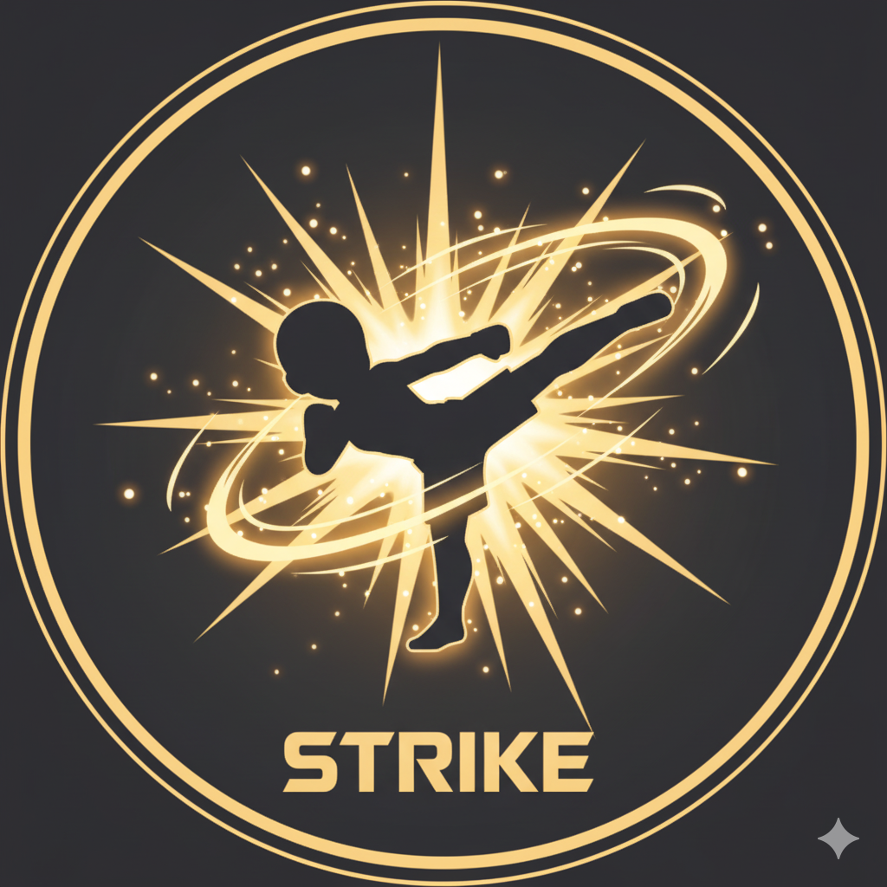
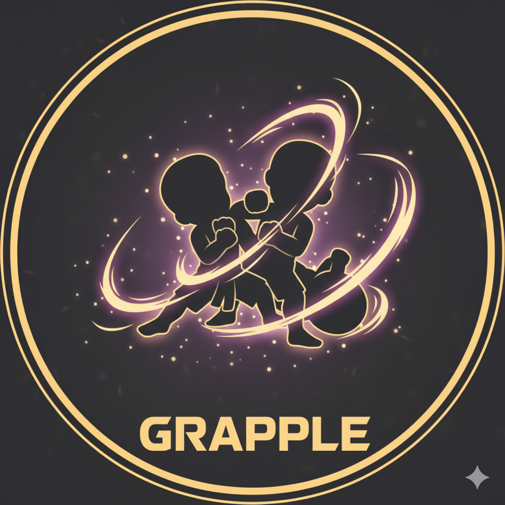
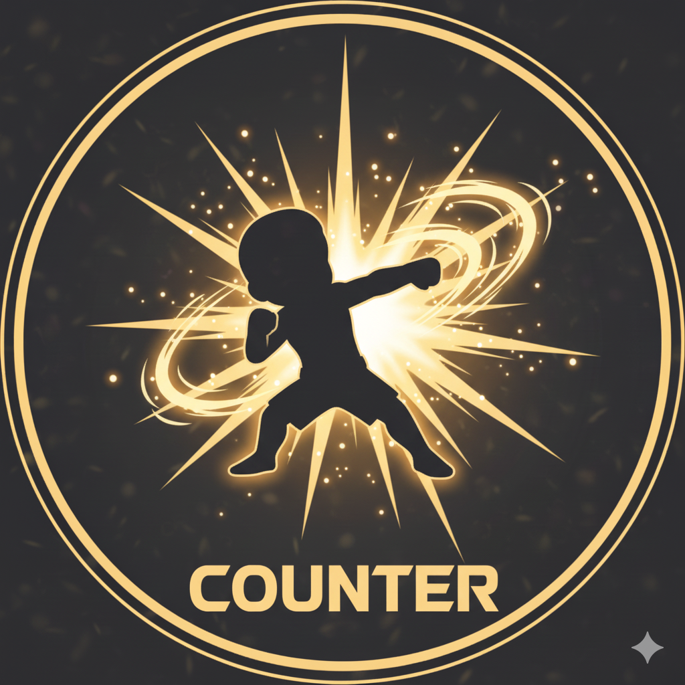

# KIZUNA × ONE Championship – Pitch Deck (Draft Slides)

> 日本語と英語を併記しています。実際のスライドでは片方だけ表示するか、レイヤーで切り替えてください。

---

## Slide 1 – Title / Concept

**JP**  
- タイトル: `KIZUNA – ONE Championship Fan OS`  
- サブタイトル: `ファン同士・ファンと選手を「絆」でつなぐWeb3プラットフォーム`

**EN**  
- Title: `KIZUNA – The Fan OS for ONE Championship`  
- Subtitle: `A Web3 platform that connects fans and fighters through “Kizuna” (bond)`

**Visual**  
- メインビジュアル（Plazaイメージ）  
  - `kizuna/public/KIZUNA.png`  
  - 例: ``

---

## Slide 2 – ONEが目指すものと現状のギャップ (Goals & Gaps)

**JP**  
- ONEがほしい成果  
  - ライブ視聴のアクティブ率・視聴時間アップ  
  - チケット・PPV・グッズなどへのコンバージョン向上  
  - コミュニティ熱量の可視化によるスポンサー価値の向上  
- 現状の課題  
  - 「誰がどれだけコアファンか」がデータとして見えづらい  
  - ライブ配信・会場・SNS・グッズなどの行動履歴がバラバラに散らばっている

**EN**  
- What ONE wants  
  - Higher live engagement and watch-time  
  - Better conversion to tickets, PPV, and merch  
  - Visible community heat that increases sponsor value  
- Current gaps  
  - No unified view of who the true core fans are  
  - Fan actions across streams, arenas, and socials are fragmented

---

## Slide 3 – Fan Insight: 「行動が一本の物語になっていない」

**JP**  
- コアファンは「行動の履歴」と「推しを語る場」を求めている  
- しかし、今はチケット履歴や配信コメントが点で存在し、  
  `“自分はここまでONEを追ってきた”` を一言で示せない  
- 必要なのは、行動を集約し「絆レベル」として見える化するレイヤー

**EN**  
- Hardcore fans want: a persistent history of actions and a place to show their fandom  
- Today, tickets, streams, and comments live in silos – there is no single story of their journey  
- We need a layer that aggregates all actions into a single, visible “Kizuna level”

---

## Slide 4 – KIZUNA Overview: Avatar SBT + Aura

**JP**  
- ウォレットにつき1体の**アバターSBT**  
- 10種類から選べるアバター画像（画像は Walrus、状態は Sui）  
- 行動をスコア化し、3段階の**オーラレベル**として表示  
  - スタンプ（会場）  
  - ワザNFT（ライブ視聴）  
  - 推し登録・応援度  
  - バトル戦績 など

**EN**  
- One **Avatar SBT** per wallet  
- Choose from 10 avatar designs (visuals on Walrus, state on Sui)  
- All actions are scored into a 3‑level **Aura**:  
  - Venue stamps  
  - Technique NFTs from live streams  
  - Favorites / long‑term support  
  - Battle history, etc.

**Visuals**  
- アバターサンプル  
  - `kizuna/public/sample_avatar2.png`  
  - 例: ``  
- オーラ3段階（レベルごとの見た目）  
  - `kizuna/public/Level1.png`, `kizuna/public/Level2.png`, `kizuna/public/Level3.png`  
  - 例（3つ並べる）:  
    ```md
    | Aura 1 | Aura 2 | Aura 3 |
    |--------|--------|--------|
    |  |  |  |
    ```

---

## Slide 5 – Live × Technique NFTs (視聴行動の強化)

**JP**  
- 試合中に発表されるパスワードで、**時間限定のワザNFT**をミント  
- 「その試合・そのラウンドをちゃんと見ていた証拠」になる  
- 例:  
  - 3Rで決まったサブミッション技を、その場でNFTとして配布  
  - スポンサー付き「ブランド技」ドロップも可能

**EN**  
- During the fight, a password is revealed to mint a **time‑limited Technique NFT**  
- This becomes proof that you were truly watching and paying attention  
- Examples:  
  - Mint the exact submission that finished Round 3  
  - Sponsor‑branded “special moves” as a new ad surface

**Visuals**  
- ライブ画面のイメージ＋ワザアイコン  
  - ワザアイコン:  
    - `kizuna/public/strike.png`  
    - `kizuna/public/grapple.png`  
    - `kizuna/public/counter.png`  
  - 例（横一列）:  
    ```md
    
    
    
    ```

---

## Slide 6 – Venue Stamps & Favorites (オフラインと長期応援)

**JP**  
- 会場ごとの**スタンプNFT**  
  - 会場QRを読み込むと、その大会のスタンプをアバターの足元に1つだけ刻める  
  - 同じイベントは重複ミント不可＝「どこに来たか」の純粋な履歴  
- 最大3つの**Favorites**（選手・競技・国など）  
  - 長期的な応援がスコア化され、オーラレベルに反映

**EN**  
- **Venue stamp NFTs**  
  - Scan the arena QR to mint one stamp at your avatar’s feet  
  - No duplicates per event: a clean history of where you showed up  
- Up to three **Favorites** (fighters / sports / countries)  
  - Long‑term support feeds directly into your aura score

**Visual**  
- スタンプと推しをイメージしたアバター  
  - 例として `kizuna/public/avatars/woman3.png` を使用  
  - ``

---

## Slide 7 – Game: Technique Battle (遊びながらデータが貯まる)

**JP**  
- 装備したワザNFT3つで戦う、**Strike / Grapple / Counter** の三すくみバトル  
- 3ラウンドの結果を、任意でオンチェーンの戦績として記録  
- 役割:  
  - 試合のない日でも KIZUNA に戻ってくる理由  
  - 「勝ち負け」もオーラの一部として、ファン物語に組み込む

**EN**  
- A light battle game using three equipped Technique NFTs in a Strike / Grapple / Counter triangle  
- Best‑of‑three results can optionally be recorded on‑chain as battle history  
- Role:  
  - Give fans a reason to return even on non‑event days  
  - Make wins and losses part of the fan story and aura

**Visuals**  
- バトルゲーム画面イメージ  
  - `kizuna/public/game.png`  
  - 例: ``  
- 併せてワザアイコン3種を小さく配置（同じく `strike/grapple/counter.png`）

---

## Slide 8 – KIZUNA Plaza (Social Layer)

**JP**  
- アバターで歩き回れる2Dロビー  
- できること:  
  - その場でチャット  
  - アバターをクリックしてオーラ・推し・スタンプ履歴を閲覧  
- `「あの人、○○選手をめちゃ推してる！」` が一目で分かる  
  - ファン同士・選手とのネットワーキングや会話のきっかけになる

**EN**  
- A 2D lobby where avatars walk around and gather  
- You can:  
  - Chat in the space  
  - Click avatars to see their aura, favorites, and event history  
- Instantly see who is devoted to which fighter, turning profiles into natural conversation starters for networking

**Visual**  
- KIZUNA Plaza コンセプトアート  
  - `kizuna/public/KIZUNA.png`  
  - 例: ``

---

## Slide 9 – Dynamic Aura: Visualizing Fandom

**JP**  
- オーラは**ダイナミックNFT**  
  - スタンプ数・ワザNFT・ライブ視聴スコア・Favorites などからスコアを計算  
  - 3段階のオーラレベルにマッピング  
- レベルが上がるほど光が強くなり、  
  `「この人はどれだけONEを追いかけているか」` が一目で伝わる

**EN**  
- Aura is a **dynamic NFT**  
  - Aggregates stamps, Technique NFTs, live watch score, and favorites  
  - Maps into three aura levels  
- The higher the level, the stronger the glow — anyone can instantly see how committed a fan is to ONE

**Visual**  
- 3段階オーラ比較（Slide 4と同じ画像を再利用）  
  - `kizuna/public/Level1.png`, `kizuna/public/Level2.png`, `kizuna/public/Level3.png`

---

## Slide 10 – Architecture: Sui / Walrus / Seal

**JP**  
- **Sui**  
  - アバターSBT、スタンプ、ワザNFT、Favorites、戦績、オーラ計算  
- **Walrus**  
  - アバター画像・オーラ別ビジュアルを Blob として保存  
  - コントラクトは Blob ID のみ保持し、`set_walrus_blob_id` で表示画像を差し替え  
- **Seal（今後）**  
  - SBT保有者だけが復号できる限定コメント動画やVIPフォトを配信  
  - 「本当に支えているファン」にだけ届くコンテンツレイヤー

**EN**  
- **Sui**  
  - Avatar SBT, stamps, Technique NFTs, favorites, battle records, and aura logic  
- **Walrus**  
  - Stores avatar and aura visuals as blobs; contracts keep only Blob IDs and use `set_walrus_blob_id` to switch images  
- **Seal (future)**  
  - Delivers encrypted post‑fight messages and VIP photos only decryptable by Avatar SBT holders  
  - A content layer reserved for the most engaged fans

---

## Slide 11 – KPIs & Experiment Plan

**JP**  
- 追いかける指標  
  - ライブ視聴中のワザNFT取得率  
  - 会場スタンプ取得率・再来場率  
  - Plazaアクティブユーザー数・平均滞在時間  
- 実験ステップ  
  1. テストイベント（1大会・1選手など）で限定導入  
  2. データ検証 → 対象リーグ・国・シーズンへの拡大

**EN**  
- Key metrics  
  - Technique NFT claim rate during live broadcasts  
  - Venue stamp claim rate and repeat attendance  
  - Plaza active users and session length  
- Experiment steps  
  1. Pilot with a single event or featured fighter  
  2. Validate metrics, then expand to more leagues, regions, and seasons

---

## Slide 12 – Roadmap & Closing

**JP**  
- Roadmap（例）  
  - Phase 1: テストネット + デモ / ハッカソン（現状）  
  - Phase 2: 一部公式イベントとの連動キャンペーン  
  - Phase 3: ONE公式アプリ・配信との統合、Sealによる限定コンテンツ開始  
- メッセージ  
  - KIZUNAは、ファンの行動を点ではなく「一本の絆の物語」として残すことで、  
    - ONEには「誰が本当に支えているか」を、  
    - ファンには「どれだけ推してきたか」を、  
    可視化するための“Fan OS”です。

**EN**  
- Example roadmap  
  - Phase 1: Testnet + demo / hackathon (today)  
  - Phase 2: Integrated campaigns with selected official events  
  - Phase 3: Deep integration with ONE’s apps/streams, plus SEAL‑based gated content  
- Message  
  - KIZUNA turns scattered actions into a single story of “Kizuna”,  
    - giving ONE a clear view of who truly supports them, and  
    - giving fans a way to show how far their fandom has come.  
  - In short, it acts as the **Fan OS** for ONE Championship.
