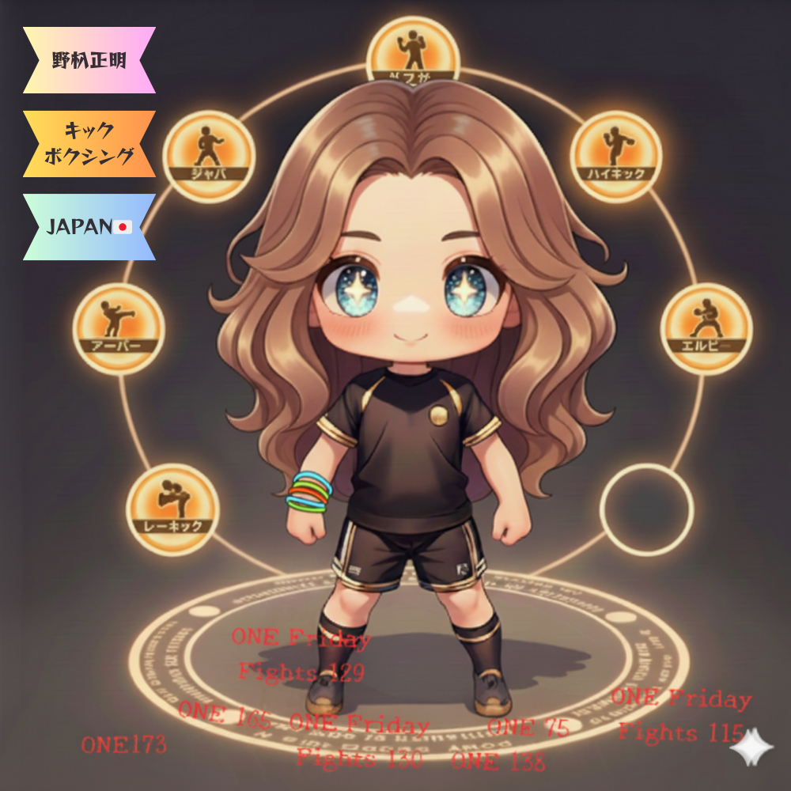
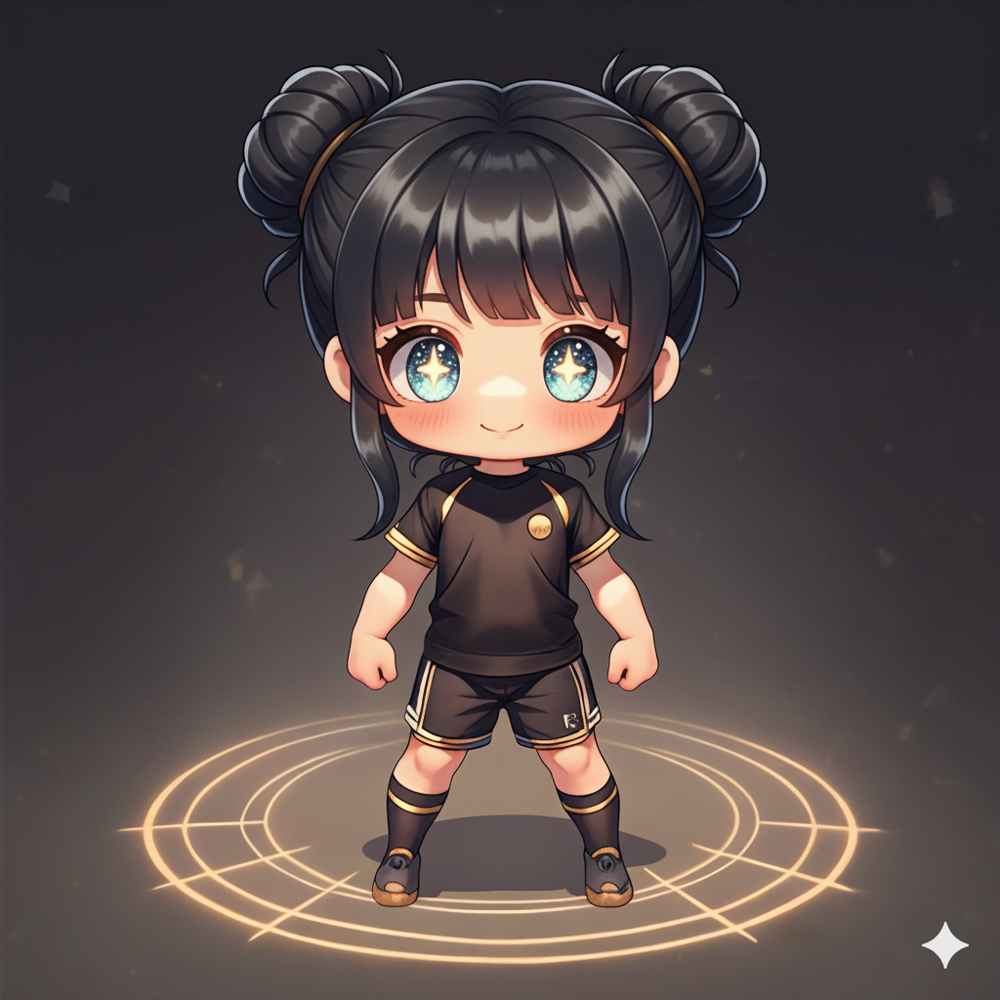
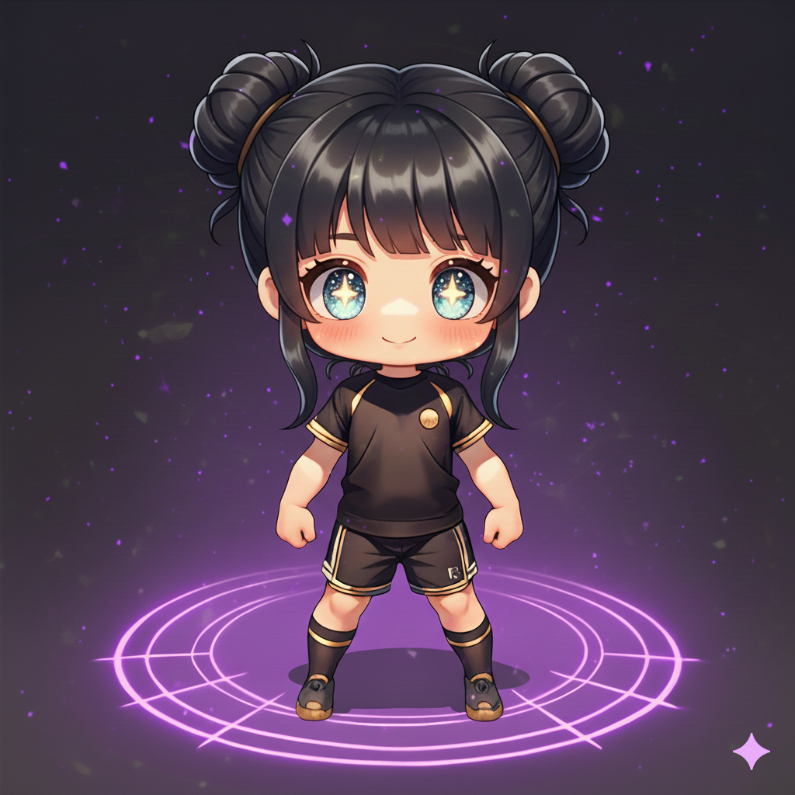
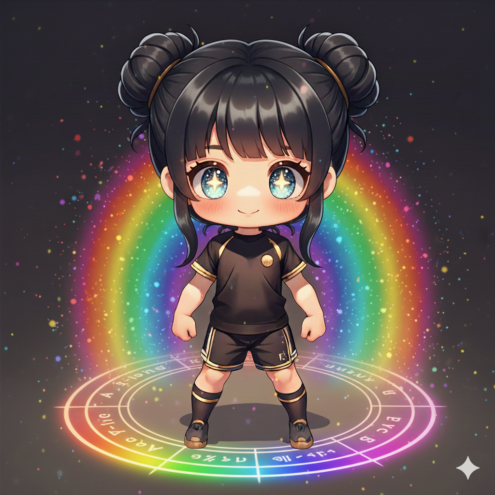

# KIZUNA — 推し活がそのまま dNFT になるファンOS

## 🇯🇵 日本語概要

### プロジェクトコンセプト

KIZUNA は、ONE Championship の「推し活」をまるごと dNFT に閉じ込めるファン向けプロジェクトです。

- ライブ配信を追いかけて「技（わざマシン）」を集める
- 会場に足を運んで「スタンプ」を貼りまくる
- 推し選手・競技・国を登録して応援する
- Plaza でファン同士／選手と交流し、軽いゲームで盛り上がる

そのすべてが **SBT アバターの見た目と Aura（オーラ）に反映される dNFT 体験** を目指しています。

---

### アバター（SBT）について

- ユーザーはウォレット接続後、「好きなアバター画像」を選んで SBT を 1 体ミントします。
- アバターは譲渡不可（SBT）で、以下の情報がオンチェーンで紐づきます：
  - 覚えた技（テクニック）
  - 会場スタンプ（観戦履歴）
  - 推し（最大3枠）
  - ゲームでの戦績
  - Aura Level（0〜3）
- 画像自体は Walrus に保存したテンプレートを使い、Move 側には Blob ID だけを持たせることで、後から表示画像を差し替えられる構造にしています。

---

### 推し活要素

#### スタンプ（会場）

- ONE の大会会場で QR を読み込むと、アバターに **会場スタンプ** を 1 つミントできます。
- 日付・会場名・イベントIDなどがオンチェーンに残り、「現地勢」ほどアバター下部のスタンプ帯が賑やかになります。

#### わざマシン ＋ ロッカー

- ライブ配信中に期間限定の URL/パスを告知し、正しく入力したファンだけが **技（Technique）** をミント。
- 技はロッカー（所持技一覧）に入り、その中から **7枠だけアバターに装備**できます。
- 「どの技を装備するか」が GAME ページのロードアウトや Plaza でのエモートにも反映されます。

#### 推し枠（Favorite）

- 選手・競技・チーム・国などを最大 3 枠まで「推し」として登録。
- 推し枠のスコアは Aura Level 計算に加点され、真のガチ勢ほど高いオーラをまといます。

---

### ライブ配信で技を MINT

- `Live` タブでは、ONE Championship の試合配信を見ながら「ミントウィンドウ」が開きます。
- 配信内で発表されるパスコードを入力すると、その時間帯だけ有効な **わざマシン（Technique）をミント**できます。
- ミントされた技はロッカーに入り、好きな 7つをアバターに装備可能。  
  → 「配信をちゃんと追った人だけが持てる技」で差別化できます。

---

### 会場限定スタンプを MINT

- 会場で配布される QR コードから dApp を開くと、**その会場限定のスタンプ** をアバターにミント。
- 1イベント1スタンプ（重複防止）で、「どの大会にどれだけ通ったか」が直感的に見えるようになります。
- Plaza や GAME では、このスタンプ数が Aura や背景演出にも反映されます。

---

### GAME ページ（じゃんけん式テクニックバトル）

- GAME タブでは、装備中の技から 3 枚を選んで **じゃんけん方式のテクニックバトル** を行います。
- 属性は `Strike / Grapple / Counter` の三すくみで、3ラウンドの合計ポイントで勝敗を決定。
- バトルロジックはオフチェーンで計算し、**結果だけを Move で記録**するハイブリッド設計です。
  - 公平で軽量なバトル
  - ガスコストを抑えつつ、「重要な勝敗だけチェーンに残す」ことができます。

---

### KIZUNA Plaza（ファン／選手との交流）

- KIZUNA Plaza は 2D ロビー空間：
  - SBT アバターを使った移動
  - ローカルチャット
  - 技アイコンを使ったエモート
  - 軽量な 1ターンバトル
- 「同じ Aura Level のファン」「同じ会場スタンプを持つファン」「同じ推し」を簡単に見つけられ、  
  ファン同士や選手との距離が縮まる設計を目指しています。

---

### dNFT: Aura が三段階に変化

推し活の成果は、最終的にアバターの **Aura（オーラ）** で表現されます。

- Aura Level は 0〜3 の 4段階
  - 0: まだ始めたて
  - 1: 常連視聴・数枚のスタンプ
  - 2: 現地勢／技もスタンプもそこそこ揃っている
  - 3: ガチ勢。配信・会場・ゲームのすべてで活躍
- Move のロジックで、  
  `total_stamps` / `equipped_tech_count` / `watch_score` / `favorites` 等をスコア化して Aura Level を決定。
- フロントでは Aura Level に応じて **色と輝きが変わるオーラ** を表示し、  
  「推し活をがんばった分だけアバターが光る」dNFT 体験になります。

| Aura Level 1 | Aura Level 2 | Aura Level 3 |
|-------------|--------------|--------------|
|  |  |  |

---

### Sui / Walrus / Seal の活用

- **Sui**
  - Avatar SBT・Technique・Stamp・Favorite を Dynamic Object Fields で管理。
  - Aura 計算・Battle 結果・現地スタンプなど「ファンの歴史」をオンチェーンに保存。
- **Walrus**
  - アバター画像テンプレートやオーラ別の画像を Walrus Blob として保存。
  - Move 側には Blob ID だけを持たせ、`set_walrus_blob_id` で表示画像を差し替え可能。  
    → オフチェーンの柔軟さ + オンチェーンの信頼性を両立。
- **Seal**
  - 配信メタデータや一部の限定コンテンツ（VIPショットなど）を暗号化する将来拡張用として組み込み。
  - 「特定のウォレットだけ復号できる写真」など、ファン向けの限定体験を想定。

---

## 🇺🇸 English Overview

### Concept

KIZUNA turns your **ONE Championship fandom** into a living dNFT.

- Watch live events and collect unique **Techniques**
- Attend venues and stack **Stamps**
- Register your **Favorites** (fighters, sports, countries) and support them over time
- Meet other fans (and fighters) in the **KIZUNA Plaza**
- Play a simple, fair **RPS-style Technique Battle** game

All of this activity feeds into a **Soulbound Avatar** whose Aura evolves in three stages, clearly showing who the real hardcore fans are.

---

### The Avatar (SBT)

- After connecting a wallet, users mint one non-transferable **Avatar SBT**.
- On-chain, the avatar tracks:
  - Equipped & owned techniques
  - Venue stamps (attendance history)
  - Favorites (up to 3 slots)
  - Battle stats
  - Aura level (0–3)
- The visual template (image) is stored off-chain on **Walrus**, while the Move contract only stores the Walrus **Blob ID**.  
  This makes updating the avatar image as simple as changing a blob reference, without redeploying contracts.

---

### Fan Activity: Techniques, Stamps, Favorites

**Venue Stamps**

- Scanning a QR code at an arena mints a **venue stamp** under the avatar.
- Each stamp is unique per event (no duplicates), so your attendance history is always consistent.
- In the UI, the bottom “stamp belt” gets more and more crowded for real on-site fans.

**Techniques & Locker**

- During live streams, a time-limited URL/passcode allows fans to mint special **Techniques**.
- Techniques are stored in a **Locker**, and only 7 can be equipped on the avatar at once.
- These equipped techniques drive the GAME loadout and Plaza emotes.

**Favorites**

- Up to 3 favorites (fighter / sport / team / country).
- Favorite scores feed into the Aura calculation—your support history actually matters.

---

### Live Stream: Minting Techniques

- The `Live` tab embeds the ONE Championship stream plus a **Mint Window**.
- When the passcode is announced on stream, entering it correctly mints a time-limited Technique into the locker.
- This makes techniques a proof of **being there and paying attention**, not just a static collection.

---

### In-Venue Only Stamps

- At physical events, scanning the venue QR allows minting a **venue-exclusive stamp** onto your avatar.
- Each event mints at most one stamp per avatar, giving a clear picture of where and when you showed up.
- Plaza and Game screens can highlight “in-person fans” by reading this on-chain history.

---

### GAME: RPS Technique Battle

- The GAME tab runs a **3-slot rock–paper–scissors style battle**:
  - Attributes: `Strike`, `Grapple`, `Counter`
  - 3 fixed rounds, points per round, highest total wins
- The battle logic is executed off-chain (for fairness and zero gas),  
  while only the **final result is stored on-chain** as an optional record.
- This hybrid model keeps gameplay snappy while still providing verifiable bragging rights.

---

### KIZUNA Plaza: Social & Fighter Interaction

- KIZUNA Plaza is a 2D lobby where SBT holders:
  - Move around with their avatars
  - Chat in local radius
  - Use equipped techniques as **emotes**
  - Trigger lightweight one-turn battles
- It’s designed as a **social layer for ONE fans**, where Aura levels, stamps, and loadouts all show up visually, 
  and where fighters can join special sessions or AMA-style events.

---

### dNFT Aura: Three Stages of Hype

Aura is the **visual representation of your fandom**.

- Aura Level 0–3:
  - 0: Newcomer
  - 1: Regular viewer with a few stamps and techniques
  - 2: Serious fan (multiple events + solid loadout)
  - 3: Hardcore—engaged in streams, venues, and battles
- Move logic aggregates:
  - `total_stamps`
  - `equipped_tech_count`
  - `watch_score`
  - Favorites and possibly battle stats
- The front-end then maps each level to a different **glow color and strength**, so your avatar literally lights up as you support more.

| Aura Level 1 | Aura Level 2 | Aura Level 3 |
|-------------|--------------|--------------|
|  |  |  |

---

### How We Use Sui / Walrus / Seal

**Sui**

- Core state:
  - Avatar SBT with Aura, stats, and references
  - Techniques, Stamps, Favorites as Dynamic Object Fields
  - Optional Battle records
- Guarantees that a fan’s history (streams watched, venues attended, loadouts used) is **verifiable and portable**.

**Walrus**

- Stores avatar base images and aura variants as **blobs**.
- The contract keeps only the Walrus Blob ID, and an owner-only `set_walrus_blob_id` updates which blob is used for display.
- This cleanly separates **state (on Sui)** from **media (on Walrus)**, and makes future visual updates cheap and safe.

**Seal**

- Reserved for encrypted fan assets:
  - VIP photos
  - Private highlights
  - “Only holders of this SBT can decrypt” content
- Allows us to go beyond open media and into **access-controlled experiences** without compromising decentralization.

---

KIZUNA is designed as a **fan OS** for ONE Championship:  
every watch, every visit, every battle, every cheer gradually turns your avatar into a glowing, unmistakable proof of your fandom.
